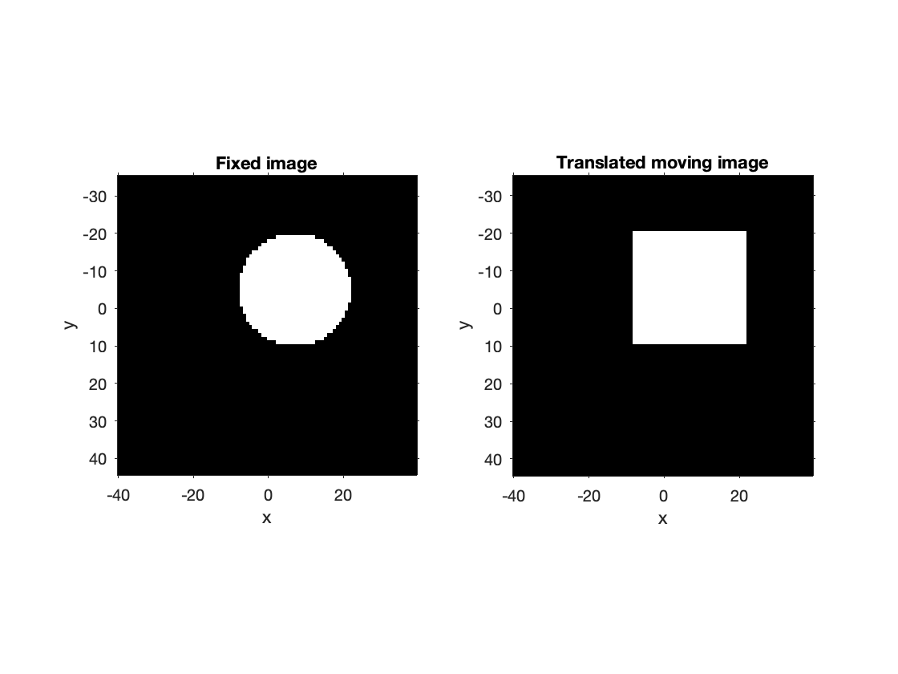

# Two-step deformable image registration

## Overview

The MATLAB functions
[imregmoment](https://uk.mathworks.com/help/medical-imaging/ref/imregmoment.html)
and
[imregtform](https://uk.mathworks.com/help/images/ref/imregtform.html)
perform image registration based on affine transforms.  They allow for
fixed image and moving image being different in any of size, voxel dimensions
and extent.  In contrast, the deformable-registration functions
[imregdeform](https://uk.mathworks.com/help/medical-imaging/ref/imregdeform.html)
and
[imregdemons](https://uk.mathworks.com/help/images/ref/imregdemons.html)
require that the characteristics of fixed and moving image be the same.

This example demonstrates deformable image registration for two images
differing in all of size, voxel dimensions and extent.  It uses a two-step
process, where the moving image of the second step is the transformed
moving image from the first step.

## Resources

This example registers a cube to a sphere, starting from images
in the format of the Neuroimaging Informatics Technology Initiative
 ([NIfTI](https://nifti.nimh.nih.gov/).

- fixed image: [sphere.nii.gz](./examples/data/sphere.nii.gz)
  - image size (rows, columns, slices): [80, 100, 40]
  - voxel size (x, y, z): [0.8, 1.0, 1.5]
  - image extent (x, y, z): [[-40.40 39.60], [-35.50 44.50], [-20.75 39.25]]
  - spere of radius 15, centred at [7, -5, 11]

- moving image: [cube.nii.gz](../examples/data/cube.nii.gz)
  - image size (rows, columns, slices): [100, 60, 50]
  - voxel size (x, y, z): [1.5, 1.2, 1.0]
  - image extent (x, y, z): [[-40.40 39.60], [-35.50 44.50], [-20.75 39.25]]
  - cube with side length 30, centred at [15, -13, 19]

The code for this example is in the script:
- [deformable_registration.m](../examples/deformable_registration.m)

## Code walk through

### 1. Initialisation
In the initialisation, a folder structure for storing results is created.

```
% Initialise workspace.
clear
close all

% Define path to results folder
resultsDir = "../registration_results";

% Ensure that results folder exists and is empty.
if exist(resultsDir, "dir")
    rmdir(resultsDir, "s")
end

% Create subfolder for each registration step.
imregtformDir = fullfile(resultsDir, "imregtformDir");
imregdeformDir = fullfile(resultsDir, "imregdeformDir");
mkdir(resultsDir)
mkdir(imregtformDir)
mkdir(imregdeformDir)
```

### 2. Definition and display of initial images.

The world coordinates of the centres of the geometrical shapes
in the two images to be registered are used to specify the image
slices to be displayed.  The coordinates and view may be altered,
to display different image features.

```
% Define paths to NIfTI files for fixed and moving image.
spherePath = "./data/sphere.nii.gz";
cubePath = "./data/cube.nii.gz";


% Use shape centres to define slices for viewing, and choose view.
xyz1 = [7, -5, 11];
xyz2 = [15, -13, 19];
view = "x-y";

% Display initial images.
niftishowpair(spherePath, cubePath, xyz1, xyz2, view=view, ...
    titles=["Fixed image", "Moving image", "Fixed image vs Moving image"])
```
<figure>


<figcaption>Initial images - fixed image with sphere; moving image
with cube.</figcaption>
</figure>

The default is to show the two images side by side in one figure,
and superimposed in another.  The former or latter may be omitted by
adding the option `separate=0` or `combined=0` to the viewing command.

### 3. First registration step

In the first registration step,
[imregtform](https://uk.mathworks.com/help/images/ref/imregtform.html)
is used to compute a translation that approximately matches the
higher-intensity region (cube) of the moving image to the higher-intensity
region (sphere) of the fixed image.  Behind the scenes, this translation
is applied to the moving image using
[imwarp](https://uk.mathworks.com/help/images/ref/imwarp.html).  The output
view is chosen so that the transformed moving image has
the same size, voxel dimensions and extent as the fixed image.
```
% Perform first registration step: translation.
matlabreg("imregtform", cubePath, spherePath, imregtformDir, ...
    "translation", "monomodal", "nearest")

% Display images after applying the translation
% from the first registration step to the moving image.
% The transformed cube is approximately superimposed on the sphere.
cubeTranslatedPath = fullfile(imregtformDir, "result.0.nii");
niftishowpair(spherePath, cubeTranslatedPath, xyz1, xyz1, view=view, ...
    titles=["Fixed image", "Translated moving image", ...
    "Fixed image vs Translated moving image"])
```
<figure>


<figcaption>Images after first registration step - fixed image with sphere;
translated moving image with cube.</figcaption>
</figure>

### 4. Second registration step

In the second registration step
[imregdeform](https://uk.mathworks.com/help/medical-imaging/ref/imregdeform.html)
is used to compute a displacement field for approximately mapping the 
higher-intensity region (cube) of the translated moving image to the
higher-intensity region (sphere) of the fixed image, and to apply this field to
deform the former image.  The deformed and translated moving image
retains the same size, voxel dimensions and extent as the fixed image.  The
transformed cube of the moving image is difficult to distinguish from the
sphere of the fixed image, indicating that the registration has done
a good job.

```
% Perform second registration step: deformation.
matlabreg("imregdeform", cubeTranslatedPath, spherePath, imregdeformDir)

% Display images after also applying the deformation
% from the second registration step to the moving image.
% The transformed cube approximately matches the sphere.
cubeDeformedPath = fullfile(imregdeformDir, "result.0.nii");
niftishowpair(spherePath, cubeDeformedPath, xyz1, xyz1, view=view, ...
    titles=["Fixed image", "Translated and deformed moving image", ...
    "Fixed image vs Translated and deformed moving image"])
```
<figure>


<figcaption>Images after second registration step - fixed image with sphere;
deformed and translated moving image, with cube deformed to approximate
sphere.</figcaption>
</figure>
